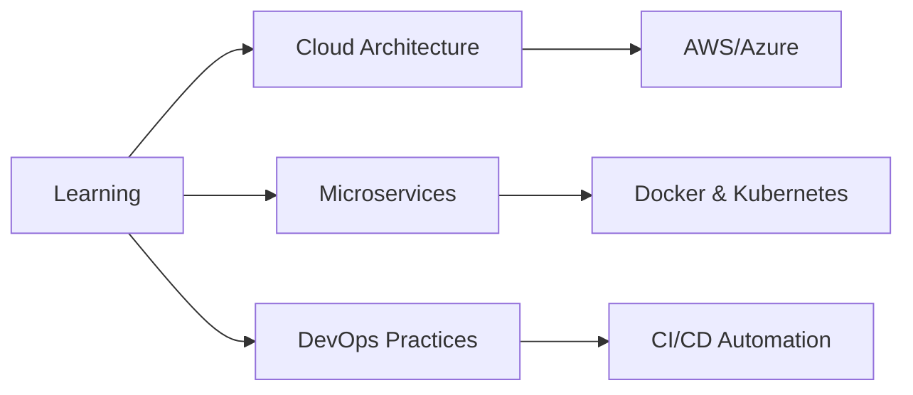

# 👋 Hi, I'm Muhamad Zaied Aziem Mohd Zaidi

<div align="center">
  
[](https://git.io/typing-svg)

</div>

## 🚀 About Me

I'm a passionate **Software Engineering undergraduate** from Malaysia, dedicated to building scalable, efficient, and innovative software solutions. My approach combines solid architectural principles with modern development practices to create applications that make a real impact.

```typescript
const zaied = {
    location: "Malaysia 🇲🇾",
    education: "Bachelor's in Software Engineering",
    focus: ["Clean Architecture", "RESTful APIs", "Full Stack Development"],
    currentlyLearning: ["Cloud Architecture", "Microservices", "DevOps"],
    lookingFor: "Internship & Full-time opportunities",
    funFact: "I transform coffee into code ☕️"
};
```

### 🎯 What I Do

- 🏗️ Build **scalable backend systems** using Clean Architecture & CQRS patterns
- 🎨 Craft **responsive web applications** with modern frameworks
- 📱 Develop **cross-platform mobile apps** using Flutter & Dart
- 🔧 Implement **CI/CD pipelines** for automated deployments
- 📊 Design **efficient database schemas** and optimize queries

---

## 💼 Technical Arsenal

### 🔨 Languages


### 🎯 Backend & APIs


### 🎨 Frontend


### 📱 Mobile Development


### 🗄️ Databases


### ☁️ Cloud & DevOps


### 🛠️ Tools & IDEs


### 🏗️ Architecture & Patterns
- Clean Architecture
- CQRS (Command Query Responsibility Segregation)
- Repository Pattern
- Dependency Injection
- RESTful API Design
- Microservices Architecture

---

## 🌟 Featured Projects

### 🎯 [CDN Freelancer Management API](https://github.com/zaiedaziem/cdn-freelancer-api)
> Enterprise-grade RESTful API built with Clean Architecture principles

**Tech Stack:** `.NET Core` `Entity Framework Core` `MediatR` `FluentValidation` `SQL Server`

**Key Features:**
- ✅ Complete CRUD operations with advanced search
- ✅ CQRS pattern implementation with MediatR
- ✅ Pagination & filtering for optimal performance
- ✅ Comprehensive validation using FluentValidation
- ✅ Unit testing with xUnit & Moq
- ✅ Global error handling middleware
- ✅ JWT authentication & authorization

**Highlights:**
- 🏆 Implements Clean Architecture with clear separation of concerns
- 🏆 90%+ test coverage
- 🏆 Production-ready with CI/CD pipeline

---

### 📱 [Project Name 2]
> Brief engaging description

**Tech Stack:** `Technology 1` `Technology 2` `Technology 3`

**Key Features:**
- Feature 1 with impact
- Feature 2 with results
- Feature 3 with value

---

### 🌐 [Project Name 3]
> Brief engaging description

**Tech Stack:** `Technology 1` `Technology 2` `Technology 3`

**Achievements:**
- 🎯 Achievement 1
- 🎯 Achievement 2
- 🎯 Achievement 3

---

## 📊 GitHub Analytics

<div align="center">
  


</div>

<div align="center">
  
[](https://git.io/streak-stats)

</div>

<div align="center">


</div>

---

## 🏆 Achievements & Certifications

```
🎓 Bachelor's in Software Engineering (In Progress)
💡 Clean Architecture & Design Patterns
🚀 RESTful API Development
☁️ Cloud Platform Deployment
🔧 CI/CD Pipeline Implementation
```

---

## 📈 Contribution Stats

<div align="center">


</div>

---

## 💡 Current Focus



**2025 Goals:**
- 🎯 Contribute to open-source projects
- 🎯 Master cloud architecture patterns
- 🎯 Build production-grade microservices
- 🎯 Obtain cloud certifications (Azure/AWS)
- 🎯 Secure software engineering internship

---

## 🤝 Let's Connect

<div align="center">

[](https://www.linkedin.com/in/zaied-aziem-9592ba257)
[](https://github.com/zaiedaziem)
[](https://instagram.com/zaied.aziem)
[](mailto:zaiedaziem2@gmail.com)

</div>

---

## 💬 Get In Touch

- 📧 **Email:** zaiedaziem2@gmail.com
- 🌍 **Location:** Malaysia
- 💼 **Open to:** Internships, Full-time positions, Freelance projects
- 🤝 **Collaboration:** Open-source projects, Interesting challenges

---

<div align="center">

### 💭 *"Code is like humor. When you have to explain it, it's bad."* – Cory House

---

**⭐️ From [zaiedaziem](https://github.com/zaiedaziem) | Building the future, one commit at a time**


</div>
